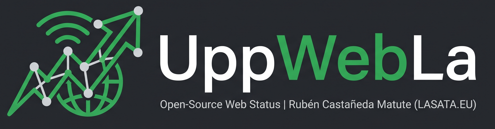



  
  <h1>💻 UppWebLa</h1>
  
<b>Monitor de estado web (Uptime) Open Source, Multirregión y 100% Serverless.</b>

---

## 🚀 ¿Qué es UppWebLa?

**UppWebLa** es un clon ultra ligero y estático de *Upptime*. Está diseñado para monitorizar el estado de tus páginas web y APIs de forma ininterrumpida utilizando la infraestructura gratuita de **GitHub Actions** y **GitHub Pages**.

A diferencia de otros sistemas, UppWebLa **no utiliza Node.js, npm, ni frameworks pesados**. Toda su arquitectura está construida con scripts puros de `Bash`, manipulación JSON con `jq` y una interfaz de usuario desarrollada en `HTML`, `CSS` y `Vanilla JS`. Esto garantiza que el proyecto jamás quedará obsoleto por dependencias desactualizadas.

## ✨ Características Principales

* 🌍 **Monitorización Multirregión:** Realiza pings simultáneos utilizando los servidores de GitHub distribuidos globalmente (América, Europa y Asia) a través de *Ubuntu*, *Windows* y *macOS*.
* 🌐 **Interfaz Multilenguaje Nativa:** El dashboard detecta automáticamente el idioma del navegador del usuario (Español o Inglés) y traduce todos los textos y formatos de fecha al instante.
* ⚡ **Ultra Ligero (Zero Dependencies):** Sin pesadas carpetas `node_modules` ni configuraciones complejas. Solo código nativo.
* 🛡️ **Anti-Caché Integrado:** Sistema inteligente en el frontend que rompe la caché de GitHub Pages para mostrar siempre el estado real en el segundo exacto.
* 💸 **100% Gratuito:** Sin costes de servidores, bases de datos o servicios de terceros. Todo se ejecuta y se aloja dentro de GitHub.

## 🛠️ ¿Cómo funciona la arquitectura?

1. **El Cron Job:** Un flujo de trabajo (`uptime.yml`) se ejecuta cada 5 minutos mediante GitHub Actions.
2. **Pings Geográficos:** Los *runners* de GitHub ejecutan peticiones `curl` a los servicios configurados desde 3 continentes distintos.
3. **Unificación:** Un trabajo final recolecta los resultados, los formatea y actualiza un archivo `data.json`.
4. **Despliegue Automático:** Un bot hace un `git push` silencioso al repositorio. GitHub Pages sirve el `index.html` estático que lee este JSON en tiempo real.

---

## 🚀 Cómo usar UppWebLa en tu propio proyecto

Eres libre de clonar este repositorio para monitorizar tus propias páginas web. Solo tienes que seguir estos pasos:

1. **Bifurcar (Fork):** Haz un *Fork* de este repositorio a tu propia cuenta de GitHub.
2. **Permisos del Bot:** * Ve a `Settings` > `Actions` > `General` en tu nuevo repositorio.
   * En "Workflow permissions", selecciona **Read and write permissions** y guarda.
3. **Configurar URLs:**
   * Edita el archivo `.github/workflows/uptime.yml`.
   * Cambia las URLs `https://lasata.eu` por las páginas web o APIs que quieras monitorizar.
4. **Activar GitHub Pages:**
   * Ve a `Settings` > `Pages`.
   * En "Source", selecciona **Deploy from a branch**.
   * Elige la rama `main` y la carpeta `/ (root)`, luego pulsa guardar.

Una vez configurado, ve a la pestaña **Actions** y ejecuta el flujo de trabajo manualmente por primera vez. ¡A partir de ahí, funcionará solo!

---

## 📄 Licencia y Copyright

Este proyecto es de código abierto y está disponible gratuitamente bajo los términos de la [Licencia MIT](LICENSE).

Creado, diseñado y mantenido con ❤️ por **[Rubén Castañeda Matute](https://github.com/lasatagameplays) (LASATA.EU)**. 

> **Nota para desarrolladores:** Eres libre de clonar, bifurcar (fork) y utilizar este sistema de monitorización para tus propias páginas web o proyectos comerciales. El único requisito legal es que **debes mantener el aviso de copyright original** y los créditos al autor en tu repositorio.
